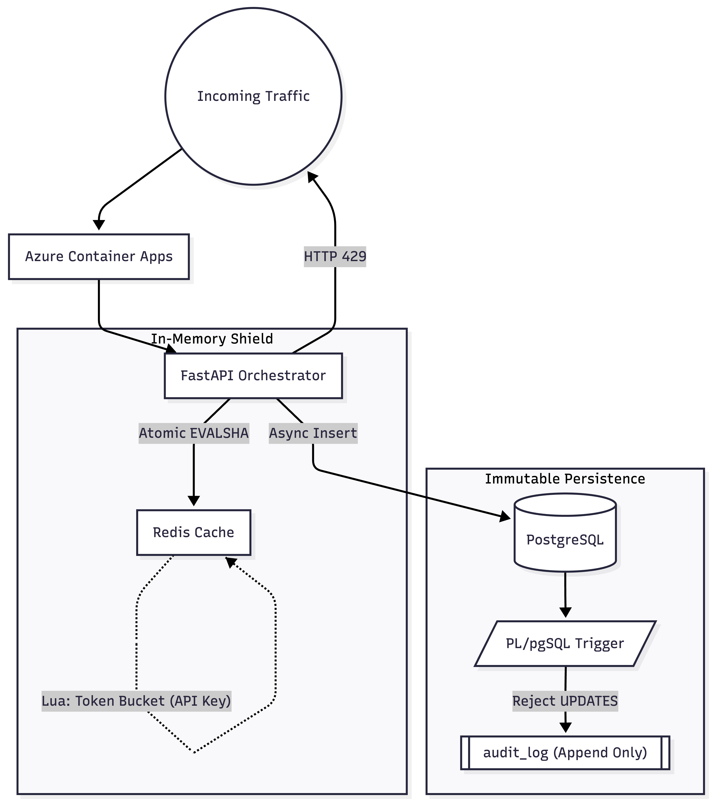

<p align="center">
  
</p>

# Viridian — Admission Controller & Rate Limiting Gateway

[](https://github.com/frostbyte8909/Viridis/actions)
[](https://opensource.org/licenses/Apache-2.0)
[](https://www.python.org/)
[](https://github.com/astral-sh/ruff)

Viridian is a high-performance, asynchronous admission control microservice designed to intercept upstream traffic and perform instantaneous, atomic rate-limiting before forwarding requests to internal microservices.

## Architecture Design

Viridian utilizes a dual-layer Redis shield to protect downstream systems from connection saturation and enforces multi-dimensional rate limiting via atomic Redis Lua scripts.



*For a comprehensive, deep-dive architectural overview and system write-up, please read the [official Viridian Architectural Overview](https://medium.com/@palash.shukla/viridis-architectural-overview-60b704049a09) on Medium.*

## Core Mechanisms

* **Atomic Rate Limiting**: All threshold checks (Token Bucket, Sliding Window) are executed as atomic Lua scripts within Redis. This completely eliminates Race Conditions and Time-Of-Check to Time-Of-Use vulnerabilities.
* **Asynchronous I/O**: Built on FastAPI and an entirely non-blocking asynchronous event loop to maximize throughput.
* **Schema Validation**: API inputs and configurations are rigorously validated via Pydantic schema enforcement.
* **Audit Immutability**: All admission decisions are permanently logged to PostgreSQL. A `PL/pgSQL` trigger enforces an append-only guarantee, blocking all UPDATE or DELETE attempts at the database engine level.

## Performance Benchmarks

Stress testing utilizing `k6` to simulate a highly concurrent production workload (1,000 distinct users, 240 active concurrent sessions).

```text
  █ TOTAL RESULTS 

    ✓ 'p(95)<200' p(95)=4.87ms

    checks_total.......: 13768  167.097119/s
    checks_failed......: 55.78% 

    HTTP
    http_req_duration..............: avg=3.41ms min=787.33µs med=1.73ms   max=153.08ms p(90)=3.4ms p(95)=4.87ms
    http_req_failed................: 0.00%  0 out of 14578
    http_reqs......................: 14578  176.927789/s

    EXECUTION
    iteration_duration.............: avg=1.06s  min=100.93ms med=106.67ms max=3.15s    p(90)=2.78s p(95)=3s    
    vus_max........................: 240    min=240        max=240
```

## Cloud & DevOps Readiness

* **Continuous Integration**: Multi-stage GitHub Actions pipelines enforcing linting, testing, and comprehensive CodeQL security scanning.
* **Infrastructure as Code**: Terraform configurations defining Cloud Run, PostgreSQL, and Redis environments.
* **Containerization**: Optimized multistage Dockerfiles for minimal production attack surface.

## Contributing

We welcome community contributions. To ensure a standardized development process, please adhere to the following guidelines.

### Submitting Feature Recommendations & Bug Reports

Before writing code, initiate a discussion via the issue tracker:
1. Navigate to the **Issues** tab.
2. Search existing issues to prevent duplication.
3. Open a new issue with a concise title and detailed description. For bugs, include reproducible steps. For features, provide the architectural rationale and impact analysis.

### Development Workflow

1. **Fork the Repository**: Create a personal fork of the repository.
2. **Branching Strategy**: Create an isolated branch for your work (`git checkout -b feature/your-feature-name` or `bugfix/issue-description`).
3. **Implementation**: Develop your changes. All Python code must comply with the repository's strict linting and typing standards. Run `ruff check .` and `mypy app` prior to committing.
4. **Testing**: Write comprehensive unit tests for all new business logic. Validate the suite using `pytest`.
5. **Commit Conventions**: Use standardized, descriptive commit messages (e.g., `feat: implement token bucket`, `fix: resolve race condition in cache`).
6. **Pull Requests**: Submit a PR targeting the `main` branch. Ensure the PR description directly links to the relevant issue and outlines the verification steps performed.

## License

This project is licensed under the Apache License 2.0. See the `LICENSE` file for details.
