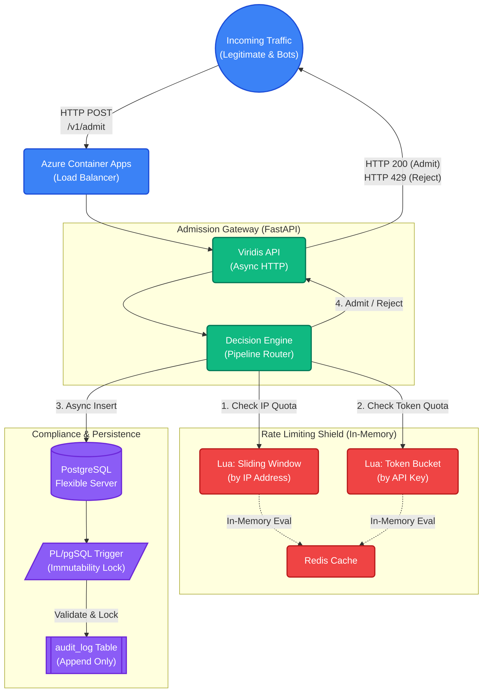

<div align="center">
  <h1>Project Viridis 🛡️</h1>
  <p><b>High-Performance, Asynchronous Admission Controller & Rate Limiting Gateway</b></p>
  <p>Built with FastAPI, Redis Lua, PostgreSQL, and Azure Container Apps.</p>
</div>

<hr/>

## 🏗️ Architecture Design

Viridis is designed to intercept upstream traffic and perform instantaneous, atomic rate-limiting before forwarding the traffic to internal microservices. It utilizes a dual-layer Redis shield to protect downstream databases from connection saturation.



---

## 🚦 Live Rate Limiting in Action

Because rate limiting checks are pushed down directly into the Redis engine via **atomic Lua scripts**, the system completely avoids Race Conditions (Time-Of-Check to Time-Of-Use vulnerabilities).

> 🎥 *Below is a live demonstration of a user exceeding their Token Bucket quota. Notice the instantaneous cutoff generated by the Decision Engine.*


*(To reproduce this test locally, run `bash demo_v1/recordings/trigger_rate_limit.sh`)*

---

## ⚡ Performance & Concurrency Benchmarks

Viridis is built on a fully asynchronous event loop. In stress tests utilizing `k6`, the framework successfully routed highly concurrent traffic with **zero dropped connections** and sub-5ms latencies.

**Load Test Profile:** `k6` simulation of a peak-traffic SaaS application (1,000 distinct users, 240 active concurrent sessions, mix of human traffic and aggressive botnets).

```text
  █ TOTAL RESULTS 

    ✓ 'p(95)<200' p(95)=4.87ms

    checks_total.......: 13768  167.097119/s
    checks_failed......: 55.78% (Expected: Scrapers successfully blocked by 429s)

    HTTP
    http_req_duration..............: avg=3.41ms min=787.33µs med=1.73ms   max=153.08ms p(90)=3.4ms p(95)=4.87ms
    http_req_failed................: 0.00%  0 out of 14578
    http_reqs......................: 14578  176.927789/s

    EXECUTION
    iteration_duration.............: avg=1.06s  min=100.93ms med=106.67ms max=3.15s    p(90)=2.78s p(95)=3s    
    vus_max........................: 240    min=240        max=240
```

---

## 📖 Interactive API Documentation

The API uses **Pydantic** for rigorous schema validation. The frontend Swagger UI is auto-generated by FastAPI.


---

## ☁️ Cloud & DevOps Readiness
This project utilizes a modern DevOps toolchain:
- **CI/CD:** Multi-stage GitHub Actions pipeline (`lint`, `test`, `trivy` security scanning, `k6` staging smoke tests).
- **IaC:** Azure Bicep templates defining Azure Container Apps Environments, PostgreSQL Flexible Servers, and Premium Redis Caches.
- **Compliance:** Alembic-managed database schema with `PL/pgSQL` immutability triggers.
