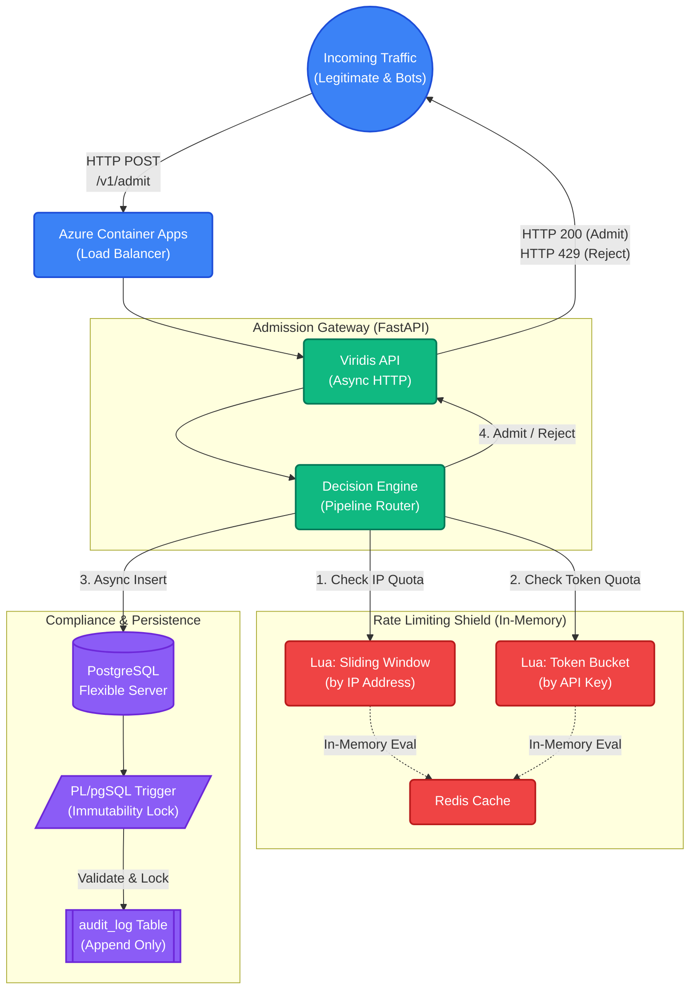

# Viridis Architecture

```mermaid
flowchart TD
    %% Define Styles
    classDef client fill:#3b82f6,stroke:#1d4ed8,color:white,stroke-width:2px,rx:5px,ry:5px
    classDef fastapiserver fill:#10b981,stroke:#047857,color:white,stroke-width:2px,rx:5px,ry:5px
    classDef redis fill:#ef4444,stroke:#b91c1c,color:white,stroke-width:2px,rx:5px,ry:5px
    classDef db fill:#8b5cf6,stroke:#6d28d9,color:white,stroke-width:2px,rx:5px,ry:5px
    classDef worker fill:#f59e0b,stroke:#b45309,color:white,stroke-width:2px,rx:5px,ry:5px

    %% Nodes
    Client(("Incoming Traffic\n(Legitimate & Bots)")):::client
    LoadBalancer["Azure Container Apps\n(Load Balancer)"]:::client
    
    subgraph "Admission Gateway (FastAPI)"
        API["Viridis API\n(Async HTTP)"]:::fastapiserver
        Orchestrator["Decision Engine\n(Pipeline Router)"]:::fastapiserver
    end

    subgraph "Rate Limiting Shield (In-Memory)"
        Redis["Redis Cache"]:::redis
        IPLimit["Lua: Sliding Window\n(by IP Address)"]:::redis
        TokenLimit["Lua: Token Bucket\n(by API Key)"]:::redis
    end

    subgraph "Compliance & Persistence"
        Postgres[(PostgreSQL\nFlexible Server)]:::db
        Trigger[/"PL/pgSQL Trigger\n(Immutability Lock)"/]:::db
        AuditLog[["audit_log Table\n(Append Only)"]]:::db
    end

    %% Connections
    Client -- "HTTP POST\n/v1/admit" --> LoadBalancer
    LoadBalancer --> API
    API --> Orchestrator
    
    %% Redis interactions
    Orchestrator -- "1. Check IP Quota" --> IPLimit
    IPLimit -. "In-Memory Eval" .-> Redis
    Orchestrator -- "2. Check Token Quota" --> TokenLimit
    TokenLimit -. "In-Memory Eval" .-> Redis

    %% Postgres interactions
    Orchestrator -- "3. Async Insert" --> Postgres
    Postgres --> Trigger
    Trigger -- "Validate & Lock" --> AuditLog

    %% Return flow
    Orchestrator -- "4. Admit / Reject" --> API
    API -- "HTTP 200 (Admit)\nHTTP 429 (Reject)" --> Client

```
